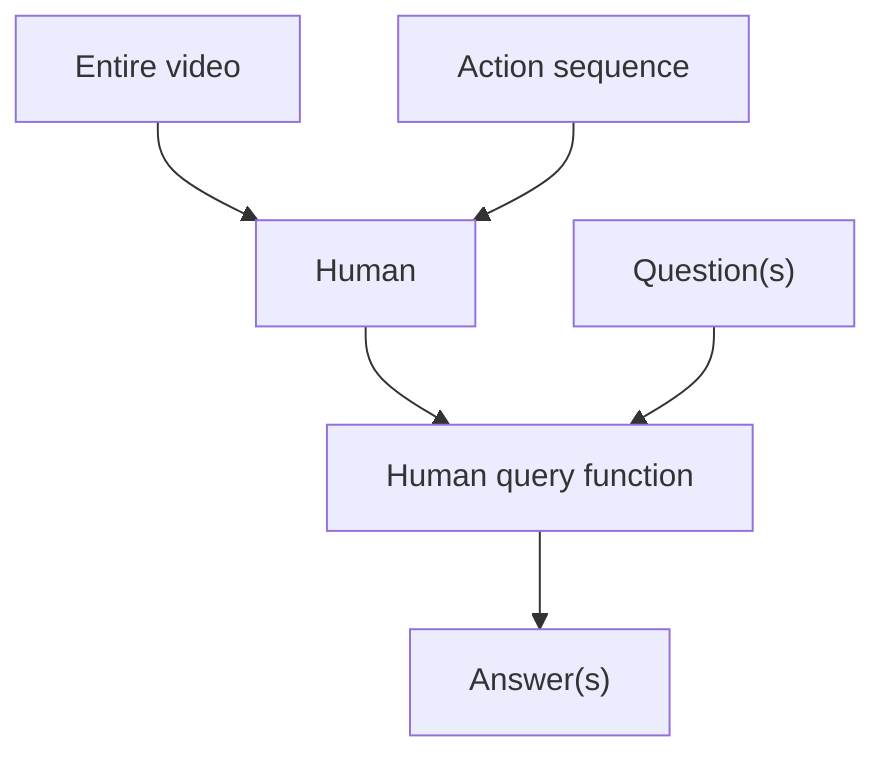

When I decided to design my own website, I had no experience with web development. After 202 days, 2,220+ commits,[^commits] and 1,008 unit tests, I present `turntrout.com` - the result of my inexperience.

I'm proud of this website and its design. Indulge me and let me explain the choices I made along the way.

[^commits]: I counted my commits by running `git log --author="Alex Turner" --oneline | wc -l`.


Figure: The beginning of my journey, rendered under my third commit ([`6e687609`](https://github.com/alexander-turner/TurnTrout.com/commit/6e687609a4b8f4bb14d1812c8fca5d833904729e)) on April 1, 2024.


Figure: Content rendered approximately when this article was first published ([`31bba104`](https://github.com/alexander-turner/TurnTrout.com/commit/31bba1043391e055138a07ab5da624e70bab562c)).

# Site rendering basics

The site is a fork of the [Quartz](https://quartz.jzhao.xyz/) static site generator. While [the build process](https://quartz.jzhao.xyz/advanced/architecture) is rather involved, here's what you need to know for this article:

1. Almost all of my content is written in Markdown.
2. Each page has its metadata stored in plaintext [YAML](https://en.wikipedia.org/wiki/YAML).
3. The Markdown pages are transformed in (essentially) two stages; a sequence of transformations are applied to the intermediate representations of each page.
4. The intermediate representations are emitted as webpages.
5. The webpages are pushed to Cloudflare and then walk their way into your browser!

> [!note]- More detail on the transformations  
> _Text transformations_ operate on the raw text content of each page. For example:
>
> ```typescript
> const notePattern = /^\s*[*_]*note[*_]*:[*_]* (?<text>.*)(?<![*_])[*_]*/gim
> 
> /**
>  * Converts note patterns to admonition blocks.
>  * @param text - The input text to process.
>  * @returns The text with note patterns converted to admonitions.
>  */
> export function noteAdmonition(text: string): string {
>   text = text.replaceAll(notePattern, "\n> [!note]\n>\n> $<text>")
>   return text
> }
> ```
>
> Code: Detects when my Markdown contains a line beginning with "Note:" and then converts that content into an "admonition" (which is the bubble we're inside right now).
>
> _HTML transformations_ operate on the next stage. Basically, after all the text gets transformed into other text, the Markdown document gets parsed into proto-HTML. The build process represents the proto-HTML as an [abstract syntax tree.](https://en.wikipedia.org/wiki/Abstract_syntax_tree) The upshot: HTML transformations can be much more fine-grained. For example, I can easily avoid modifying links themselves.
>
> ```typescript
> /**
>  * Replaces hyphens with en dashes in number ranges
>  *  Number ranges should use en dashes, not hyphens.
>  *  Allows for page numbers in the form "p.206-207"
>  * 
>  * @returns The text with en dashes in number ranges
>  */
> export function enDashNumberRange(text: string): string {
>   return text.replace(
>     new RegExp(`\\b(?<!\\.)((?:p\\.?)?\\d+${chr}?)-(${chr}?\\d+)(?!\\.\\d)\\b`, "g"),
>     "$1–$2",
>   )
> }
> ```
>
> Code: I wouldn't want to apply this transform to raw text because it would probably break link addresses (which often contain hyphenated sequences of numbers). However, many HTML transforms aren't text → text.

# Importing the content from my old blog

With the help of the LessWrong moderation team, I [migrated the content from my old blog](/welcome-to-the-pond) via their [GraphIQL](https://lesswrong.com/graphiql) tool. The tool outputs both Markdown and HTML versions of the posts. However, while attempting to import my posts, I found the included Markdown to be a mess. I was staring at 120 posts' worth of invalid Markdown, and - I found this out the hard way - the mess was too complicated to RegEx my way out of.

So I decided to convert the HTML to Markdown on my own using [`turndown`](https://github.com/mixmark-io/turndown). That solved the formatting issues. I was then confronted with compatibility issues. For example, throughout my six years on my old blog, there were _at least three_ footnote formats which I used. I needed to be able to parse a single format. Now imagine that issue, but sprouting up one hundred-fold.

That took a few months.

> [!info]- Details on exporting my content
> I exported my content using [this query](https://github.com/alexander-turner/TurnTrout.com/blob/import/scripts/graphiql.txt). After downloading the JSON, I ran [`process_json.cjs`](https://github.com/alexander-turner/TurnTrout.com/blob/import/scripts/process_json.cjs) to use [`turndown`](https://github.com/mixmark-io/turndown) to convert the raw HTML to (properly processed) Markdown. Finally, I [preprocessed the Markdown files.](https://github.com/alexander-turner/TurnTrout.com/blob/import/scripts/md_processing_single.py)

# Archiving and dependencies

[Cloudflare](https://www.cloudflare.com/) hosts `TurnTrout.com`. Overall, the site has few external dependencies. In nearly all cases, I host scripts, stylesheets, and media assets on my CDN. If the rest of the Web went down (besides Cloudflare), `turntrout.com` would look nearly the same.[^archive] Furthermore, minimizing embeds (e.g. `<iframe>`s) will minimize the number of invasive tracking cookies.[^video]

[^video]: To avoid YouTube tracking cookies, I even self-host [AI presidents discuss AI alignment agendas](/alignment-tier-list).

[^archive]: Examples of content which is not hosted on my website: There are several `<iframe>` embeds (e.g. Google forms and such). I also use the privacy-friendlier [`umami.is`](https://umami.is/) analytics service and load the script from their site.

My CDN brings me comfort - about 3% of my older image links had already died on LessWrong (e.g. `imgur` links expired). I think LessWrong now hosts assets on their own CDN. However, I do not want my site's content to be tied to their engineering and organizational decisions. I want my content to be timeless.

I wrote [a script](https://github.com/alexander-turner/TurnTrout.com/blob/main/scripts/r2_upload.py) which uploads and backs up relevant media files. Before pushing new assets to my `main` branch, the script:

1. Uploads the assets to my CDN (`assets.turntrout.com`);
2. Copies the assets to my local mirror of the CDN content;
3. Removes the assets so they aren't tracked by my `git` repo.

I later describe my [deployment pipeline](#deployment-pipeline) in more detail.

# Color scheme

The color scheme derives from the [Catppuccin](https://catppuccin.com) "latte" (light mode) and "frappe" (dark mode) [palettes](https://github.com/catppuccin/catppuccin/tree/main?tab=readme-ov-file#-palette).


Figure: The four Catppuccin palettes.

## Themes

I like the pastel palettes provided by Catppuccin:

<figure>
<div style="display: grid; grid-template-columns: repeat(auto-fit, minmax(min(100%, 300px), 1fr)); gap: 1.5rem; margin-bottom: 1rem;">
  <span id="light-demo" class="light-mode" style="border-radius: 5px; padding: 1rem 2rem; border: 2px var(--midground) solid;">
    <center>Light mode</center>
    <div style="display: grid; grid-template-columns: repeat(auto-fit, minmax(70px, 1fr)); gap: 1rem; place-items: center; margin-top: .5rem; margin-bottom: .25rem;">
      <span style="color: red;">Red</span>
      <span style="color: orange;">Orange</span>
      <span style="color: yellow;">Yellow</span>
      <span style="color: green;">Green</span>
      <span style="color: blue;">Blue</span>
      <span style="color: purple;">Purple</span>
    </div>
    <center></center>
  </span>
  <span id="dark-demo" class="dark-mode" style="border-radius: 5px; padding: 1rem 2rem; border: 2px var(--midground) solid;">
    <center>Dark mode</center>
    <div style="display: grid; grid-template-columns: repeat(auto-fit, minmax(70px, 1fr)); gap: 1rem; place-items: center; margin-top: .5rem; margin-bottom: .25rem;">
      <span style="color: red;">Red</span>
      <span style="color: orange;">Orange</span>
      <span style="color: yellow;">Yellow</span>
      <span style="color: green;">Green</span>
      <span style="color: blue;">Blue</span>
      <span style="color: purple;">Purple</span>
    </div>
    <center></center>
  </span>
</div>
<figcaption>The palettes for light and dark mode. In dark mode, I decrease the saturation of image assets.</figcaption>
</figure>

I use the darkest text color sparingly. The margin text is medium-contrast, as are e.g. list numbers and bullets. I even used CSS to dynamically adjust the luminance of select favicons, avoiding the scourge of common jet-black favicons mixed in with my softer text color. My dark mode button rotates between "automatic", "force light mode", and "force dark mode."

## Colors should accent content

Color is important to this website, but I need to be tasteful and strict in my usage or the site turns into a mess. For example, in-line [favicons](https://en.wikipedia.org/wiki/Favicon) are colorless (e.g. [YouTube's](https://youtube.com) logo is definitely red). To choose otherwise is to choose chaos and distraction.

When designing visual content, I consider where the reader's eyes go. People visit my site to read my content, and so _the content should catch their eyes first_. The desktop pond scene (with the goose) is the only exception to this rule. I decided that on the desktop, I want a reader to load the page, marvel and smile at the scenic pond, and then bring their eyes to the main text (which has high contrast and is the obvious next visual attractor).

During the build process, I convert all naive CSS assignments of `color:red` (<span style="color:rgb(255,0,0);">imagine if I made you read this</span>) to <span style="color:red">the site's red</span>. Lots of my old equations used raw `red` / `green` / `blue` colors because that's all that my old blog allowed; these colors are converted to the site theme. I even override and standardize the colors used for syntax highlighting in the code blocks.

# Site responsiveness

As a static webpage, my life is much simpler than the lives of most web developers. However, by default, users would have to wait a few seconds for each page to load, which I consider unacceptable. I want my site to be responsive even on mobile on slow connections.

Quartz offers basic optimizations, such as [lazy loading](https://developer.mozilla.org/en-US/docs/Web/Performance/Lazy_loading) of assets and [minifying](https://en.wikipedia.org/wiki/Minification_(programming)) JavaScript and CSS files. I further marked the core CSS files for preloading. However, there are a range of more interesting optimizations which Quartz and I implement.

## Asset compression

### Fonts

EB Garamond Regular 8pt takes 260KB as an `otf` file but compresses to 80KB under [the newer `woff2` format.](https://www.w3.org/TR/WOFF2/) In all, the font footprint shrinks from 1.5MB to about 609KB for most pages. I toyed around with manual [font subsetting](https://fonts.google.com/knowledge/glossary/subsetting) but it seemed too hard to predict which characters my site _never_ uses. While I could subset each page with only the required glyphs, that would add overhead and complicate client-side caching, likely resulting in a net slowdown.

I use [`subfont`](https://github.com/Munter/subfont) to subset each font across my entire website, taking the font footprint from 609KB to 113KB - a reduction of over 5x! Eventually, the ultimate solution will be [progressive font enrichment](https://www.w3.org/TR/PFE-evaluation/), which will load just those glyphs needed for a webpage, and then cache those glyphs so that they aren't reloaded during future calls. Sadly, progressive font enrichment is not yet available.

### Images

Among lossy compression formats, there are two kings: AVIF and WEBP. Under my tests, they achieved similar (amazing) compression ratios of about 10x over PNG. For compatibility reasons, I chose AVIF. The upshot is that _images are nearly costless in terms of responsiveness_, which is liberating.

To demonstrate this liberty, I perform a statistical analysis of the 941 AVIF files hosted on my CDN as of November 9, 2024.[^colab] I downloaded each AVIF file and used `magick` to convert it back to a PNG, measuring the size before and after.


Figure: At first blush, most of the compression ratios seem unimpressive. However, the vast majority of the "images" are [favicons](#inline-favicons) which show up next to URLs. These images are already tiny as PNGs (e.g. 2KB), so AVIF can only compress them so much.  

<figure> <figcaption>This friendly <abbr class="small-caps">avif</abbr> goose clocks in below <abbr class="small-caps">45kb</abbr>, while its <abbr class="small-caps">png</abbr> equivalent weighs <abbr class="small-caps">450kb</abbr>—a 10× increase!</figcaption></figure>


Figure: Now the huge savings of AVIF are clearer.

[^colab]: I used a [publicly accessible Colab](https://colab.research.google.com/drive/1XScXuubpzcyhjU6uYRN0ikHVzLFmJj6X?usp=sharing) to generate the AVIF -> PNG compression graphs.

| Metric | Value |
|:-:|:--|
| Total PNG size | 280MB |
| Total AVIF size | 25MB |
| Overall space savings | 91% |

### Videos

Among modern formats, there appear to be two serious contenders: h265 MP4 ("HEVC") and WEBM (via the VP9 codec). [Reportedly,](https://bitmovin.com/blog/vp9-vs-hevc-h265/) HEVC has better compression than VP9 WEBM. In practice, I've found the opposite.

| Metric | Value |
|:-:|:--|
| Total MP4 size | 76MB |
| Total WEBM size | 61MB |
| Overall space savings from MP4 -> WEBM | 20% |

Table: Both of these formats are good compared to GIFs. My WEBM files were 10x lighter than my GIFs! For example: [the "goose in a pond" video](https://assets.turntrout.com/static/pond.webm) weighed 561KB in GIF format. The MP4 weighs 260KB while the WEBM weighs 58KB.

So why not just always use WEBM? While [Safari technically "supports" WEBM](https://caniuse.com/webm), _Safari refuses to autoplay & loop WEBMs, or to render transparency_. After reading [an article on how to stably display transparent videos across browsers](https://rotato.app/blog/transparent-videos-for-the-web), I implemented the following scheme:

```html
<video [attributes]>
    // Only Safari should support hvc1
    <source src="video.mp4" type="video/mp4; codecs=hvc1">
    // All other browsers skip the MP4 and use the second source
    <source src="video.webm" type="video/webm">
```

However, it was quite difficult to produce a transparent MP4 (as required by Safari). I eventually used `ffmpeg` to convert a non-transparent MP4 into a ProRes 444 file. I then used my Mac Finder's built-in encoding tool to convert the ProRes 444 to a MOV with transparency... Phew.

#### Website video looping

To make the site quieter and more peaceful, the desktop website's pond video (below) only plays while the mouse hovers over it.

<video autoplay loop muted playsinline><source src="https://assets.turntrout.com/static/images/posts/pond-video-interaction.mp4" type="video/mp4; codecs=hvc1"><source src="https://assets.turntrout.com/static/images/posts/pond-video-interaction.webm" type="video/webm"></video>

Figure: By using [`micromorph`](https://github.com/natemoo-re/micromorph) to preserve the video element, the video doesn't even unload as you navigate through the site. Therefore, the current video frame stays constant until the user hovers over the video again. Furthermore, since auto/light/dark mode selector is above the pond, that provides a natural interaction pathway for the user to realize the "pond image" is actually a "pond video"!

<!-- spellchecker-disable -->
> [!quote] [`gwern`](https://www.lesswrong.com/posts/Nq2BtFidsnhfLuNAx/announcing-turntrout-com-my-new-digital-home?commentId=vJAsuKGLMmuWCb45h), who suggested this design choice
>
> In fact, why not make 'fun on hover' a core design principle? "If not friend, why friend-shaped?" Make everything on the site a little friend you can play with. (This would be a good time to try to write down a few catchphrases or design principles to sum up your goals here. Why dropcaps or the animated pond logo? etc) When I look at your pond, I feel like it would be wonderful if the pond was animated on hover - if when I hovered, _then_ it was animated.
>
> \[...\]
>
> I also still think that the logo should probably not play by default, and for animations like this, it's better to take an Apple-like attitude about them being enhancements, opted into by user actions, to 'spark joy', but not to be used by default. What do the worst websites do? They animate tons of stuff gratuitously. How much more delightful it is to discover a website with taste & restraint, where there are easter eggs and features to discover as you surf, where, say, the animated logo plays only when you hover over it... Truly an oasis or quiet little pond amidst the howling desert of the contemporary Internet.
>
> I'm reminded of a _Family Guy_ meme I re-ran into recently: why does Peter Griffin dislike _The Godfather_? Because ["It insists upon itself."](https://x.com/SethMacFarlane/status/1881825910040702979) A website animating the logo unasked for insists upon itself. And this helps instill a design feature: you the reader are in control, and you express this control in part because you can hover over _everything_ to learn more or focus on some things.
<!-- spellchecker-enable -->

## Inlining critical CSS

Even after minification, it takes time for the client to load the main CSS stylesheet. During this time, the site looks like garbage. One solution is to manually include the most crucial styles in the HTML header, but that's brittle.

Instead, I hooked [the `critical` package](https://github.com/addyosmani/critical) into the end of the production build process. After emitting the webpages, the process computes which "critical" styles are necessary to display the first glimpse of the page. These critical styles are inlined into the header so that they load immediately, without waiting for the entire stylesheet to load. When the page loads, it quickly notes the status of light vs dark mode and immediately applies the relevant theme. Once the main stylesheet loads, I delete the inlined styles (as they are superfluous at best).

## Deduplicating HTML requests

When loading a new page, the [`micromorph` package](https://github.com/natemoo-re/micromorph) selectively loads the new elements in the page. The shared elements are not updated, cutting load times.

# Text presentation

## Sizing

This website contains many design elements. To maintain a regular, assured style and to avoid patchwork chaos, I made two important design choices.

Exponential font sizing
: I fixed a base font size -- 20px on mobile, to 22px on tablets, to 24px on full displays. I read up on [how many characters should be on a single line in order to maximize readability](https://baymard.com/blog/line-length-readability) - apparently between 50 and 60. On desktop, I set the center column to 750PX (yielding about 75 characters per line).[^characters] I decided not to indent paragraphs because that made the left margin boundary too ragged.

: After consulting [TypeScale](https://typescale.com/), I scaled the font by $1.2^n$, with $n=0$ for body text and $n\geq 1$ for headers:

: <span class="h1">Header 1</span>
<span class="h2">Header 2</span>
<span class="h3">Header 3</span>
<span class="h4">Header 4</span>
<span class="h5">Header 5</span>

: <span>Normal text</span>
<span style="font-size:var(--text-size-90)">Smaller text</span>
<span style="font-size:var(--text-size-85)">Smaller text</span>
<span style="font-size:var(--text-size-80)">Smaller text</span>
<span style="font-size:var(--text-size-70)">Smaller text</span>

All spacing is a simple multiple of a base measurement
: If - for example - paragraphs were separated by 3.14 lines of space but headings had 2.53 lines of margin beneath them, that would look chaotic. Instead, I fixed a "base margin" variable and then made all margin and padding calculations be simple fractional multiples (e.g. 1.5x, 2x) of that base margin.

[^characters]: 60 characters per line seemed awkwardly narrow to me, so I went for 75 per line.

## Font selection

The font family is the open-source [EB Garamond](https://github.com/georgd/EB-Garamond). The `monospace` font is [Fira Code VF](https://github.com/tonsky/FiraCode), which brings a range of ligatures.


Figure: _Ligatures_ transform sequences of characters (like "<span style="font-variant-ligatures:none;"><code>\<\=</code></span>") into a single glyph (like "`<=`").


Figure: I love sweating the small stuff. :) Notice how aligned "`FlTl`" is!

My site contains a range of fun fonts which I rarely use. For example, the _Lord of the Rings_ font "Tengwar Annatar" renders Elvish glyphs.

<!-- spellchecker-disable -->
> [!quote]- [_Namárië_: Galadriel's Lament in Lórien](https://www.youtube.com/watch?v=re5_lzlFS9M)
>
> Subtitle: Hover over a line to translate
>
> <center><audio src="https://assets.turntrout.com/static/audio/namarie.mp3" controls/></center>
>
> <em><span class="elvish" data-content="Ah! like gold fall the leaves in the wind,">hEÁ jyE7\`B\`V j1pE6E j8"\#\`B 8\~M75%5$ =</span></em>
>
> <em><span class="elvish" data-content="long years numberless as the wings of trees!">h\~V5\`B \~M5\~N1t%\`V rÈ 6\~Ct6E j\#27E5^Á</span></em>
>
> <em><span class="elvish" data-content="The years have passed like swift draughts">h\~V5\`B rÈ j1pT\`V hj&26E r\#\~C5\`B6R</span></em>
>
> <em><span class="elvish" data-content="of the sweet mead in lofty halls beyond the West,">t\`B 7Yt^6E2\`B j8È%\`'\t7Tr&\~N7r\$\`C</span></em>
>
> <em><span class="elvish" data-content="beneath the blue vaults of Varda">2P\#\~M5\`V qj\$¸\`C = r6E2\`N 1j\$¸t&6E</span></em>
>
> <em><span class="elvish" data-content="wherein the stars tremble in the song of her voice, holy and queenly.">5\`M jhM5\`B h8"\#5\$ 11pTj%6E \`B j\$5\$\`B</span></em>
>
> <em><span class="elvish" data-content="Who now shall refill the cup for me?">\~Nt7E\`Û\`N hE71R\~C7\`B\j\~B75%5\$ -</span></em>
>
> <br>
> <em><span class="elvish" data-content="For now the Kindler, Varda, the Queen of the Stars,">8\~B t5\# \`B hj&t\`C 55% 5\$zé1pEr&\`CÀ</span></em>
>
> <br>
> <em><span class="elvish" data-content="from Mount Everwhite has uplifted her hands like clouds,">5\# 8\~B 11pTj\#¸\`V r6E2\`C hYj^8"^\`V\`N</span></em>
>
> <em><span class="elvish" data-content="and all paths are drowned deep in shadow;">rÈ e5\#\`Û\`C6 t\~C7\`Û\`C1 j\$1pR\~C7\`B 6Y15\#\`V =</span></em>
>
> <em><span class="elvish" data-content="and out of a grey country darkness">6E j%\`VÛ 1\`B6R 2P&j&\~Cr\`V jwP&j&\`VÂ</span></em>
>
> <em><span class="elvish" data-content="lies on the foaming waves between us,">6E 82P%5\#\~N7\`Bj\$¸\`N zhE1\`C t6Y5\`B\`V</span></em>
>
> <em><span class="elvish" data-content="and mist covers the jewels of Calacirya for ever.">\`B ej\#tj\#5"%6E wP%\`V t1R = 6E 9\~B8\`B\`V</span></em>
>
> <em><span class="elvish" data-content="Now lost, lost to those from the East is Valimar!">1pU\~Mq\`C zj\#iD7T\`Û\`N t\~B7\`B hYj\#\`V -</span></em>
>
> <br>
> <em><span class="elvish" data-content="Farewell! Maybe thou shalt find Valimar.">8\~B r5\#y\`C 5\~C = 6\~Ntj\$¸\`N r5\#y\`C = rj\#t%6EÁ</span></em>
>
> <br>
> <em><span class="elvish" data-content="Maybe even thou shalt find it. Farewell!">5t\#\~C7\`B\`VÁ 5hE 97Tr&j\#\`VÛ rj\#t%6E -</span></em>

<!-- spellchecker-enable -->

<span class="float-right" style="margin-top: 2rem; ">
<div class="dropcap" data-first-letter="A" style="font-size: 4rem; color: var(--foreground);--before-color:var(--foreground);">A</div>
<figcaption>Monochromatic dropcaps seem somewhat illegible.</figcaption>
</span>

## Dropcaps

I have long appreciated [illuminated calligraphy.](https://www.atlasobscura.com/articles/illluminated-manuscript-calligraphy-guide) In particular, a [dropcap](https://en.wikipedia.org/wiki/Initial) lends gravity and elegance to a text. Furthermore, EB Garamond dropcaps are available.

However, implementation was tricky. As shown with the figure's "A",  CSS assigns a single color to each text element. To get around this obstacle, I took advantage of the fact that EB Garamond dropcaps can be split into the foreground and background.

<center style="font-size:4rem;">
<span class="dropcap" data-first-letter="A" style="margin-right: 5rem;display:inline;"></span>
<span class="dropcap" data-first-letter="" style="color: var(--foreground);">A</span>
</center>

However, text [blocks](https://developer.mozilla.org/en-US/docs/Web/CSS/display) other text; only one letter can be in a given spot - right? Wrong! By rendering the normal letter as the background dropcap font, I apply a different (lighter) color to the dropcap background. I then use [the CSS `::before` pseudo-element](https://developer.mozilla.org/en-US/docs/Web/CSS/::before) to render _another_ glyph in the foreground. The result:

<center>
<span class="dropcap" data-first-letter="A" style="font-size:4rem;">A</span>
</center>

> [!note]- Dropcap CSS
> Here are the core elements of the regex which styles the dropcaps:
>
> ```scss
> .dropcap {
>    // The background glyph 
>    font-family: "EBGaramondInitialsF1";
>    color: var(--midground-faint);
>    position: relative;
>    text-transform: uppercase;
>  
>    &::before {
>      // The foreground glyph  
>      font-family: "EBGaramondInitialsF2";
>      color: var(--foreground);
>      content: attr(data-first-letter);
>      position: absolute;
>    }
>  }
> ```

A less theme-disciplined man than myself might even flaunt dropcap colorings!

<center id="the-pond-dropcaps" style="font-size:min(4rem, 15vw); line-height: 1;">
<span class="dropcap" data-first-letter="T" style="--before-color: color-mix(in srgb, 55% red, var(--midground-fainter));">T</span>
<span class="dropcap" data-first-letter="H" style="--before-color: color-mix(in srgb, 55% orange, var(--midground-fainter));">H</span>
<span class="dropcap" data-first-letter="E"  style="--before-color: color-mix(in srgb, 65% yellow, var(--midground-fainter));">E</span>
<br/>  
<span class="dropcap" data-first-letter="P"  style="--before-color: color-mix(in srgb, 65% green, var(--midground-fainter));">P</span>
<span class="dropcap" data-first-letter="O"  style="--before-color: color-mix(in srgb, 65% blue, var(--midground-fainter));">O</span>
<span class="dropcap" data-first-letter="N"  style="--before-color: color-mix(in srgb, 65% purple, var(--midground-fainter));">N</span>
<span class="dropcap" data-first-letter="D"  style="--before-color: color-mix(in srgb, 65% pink, var(--midground-fainter));">D</span>
</center>

## Formatting enhancement

| Before | After |
| --: | :-- |
| <span class="no-formatting">"We did not come to fear the future. We came here to shape it." - <a href="https://en.wikisource.org/wiki/Barack_Obama_speech_to_joint_session_of_Congress,_September_2009">Barack Obama</a></span>|"We did not come to fear the future. We came here to shape it." - [Barack Obama](https://en.wikisource.org/wiki/Barack_Obama_speech_to_joint_session_of_Congress,_September_2009)|

### Automatic conversion of quotation marks

Undirected quote marks (`"test"`) look bad to me. Call me extra (I _am_ extra), but I ventured to _never have undirected quotes on my site._ Instead, double and single quotation marks automatically convert to their opening or closing counterparts. This seems like a bog-standard formatting problem, so surely there's a standard library. Right?

Sadly, no. GitHub-flavored Markdown includes a `smartypants` option, but honestly, it's sloppy. `smartypants` would emit strings like `Bill said “’ello!”` (the single quote is oriented incorrectly). So I wrote a bit of code.

> [!note]- Regex for smart quotes
>
> ```typescript
> /**
>  * Replaces quotes with smart quotes
>  * @returns The text with smart quotes
>  */
> export function niceQuotes(text: string): string {
>   // Single quotes //
>   // Ending comes first so as to not mess with the open quote (which
>   // happens in a broader range of situations, including e.g. 'sup)
>   const endingSingle = `(?<=[^\\s“'])['](?!=')(?=s?(?:[\\s.!?;,\\)—\\-]|$))`
>   text = text.replace(new RegExp(endingSingle, "gm"), "’")
>   // Contractions are sandwiched between two letters
>   const contraction = `(?<=[A-Za-z])['](?=[a-zA-Z])`
>   text = text.replace(new RegExp(contraction, "gm"), "’")
> 
>   // Beginning single quotes
>   const beginningSingle = `(^|[\\s“"])['](?=\\S)`
>   text = text.replace(new RegExp(beginningSingle, "gm"), "$1‘")
> 
>   // Double quotes //
>   const beginningDouble = new RegExp(
>     `(?<=^|\\s|[\\(\\/\\[\\{\\-—])["](?=\\.{3}|[^\\s\\)\\—,!?;:/.\\}])`,
>     "gm",
>   )
>   text = text.replace(beginningDouble, "“")
>   // Open quote after brace (generally in math mode)
>   text = text.replace(new RegExp(`(?<=\\{)( )?["]`, "g"), "$1“")
> 
>   const endingDouble = `([^\\s\\(])["](?=[\\s/\\).,;—:\\-\\}!?]|$)`
>   text = text.replace(new RegExp(endingDouble, "g"), "$1”")
> 
>   // If end of line, replace with right double quote
>   text = text.replace(new RegExp(`["]$`, "g"), "”")
>   // If single quote has a right double quote after it, replace with right single and then double
>   text = text.replace(new RegExp(`'(?=”)`, "g"), "’")
> 
>   // Periods inside quotes
>   const periodRegex = new RegExp(`(?<![!?])([’”])(?!\\.\\.\\.)\\.`, "g")
>   text = text.replace(periodRegex, ".$1")
> 
>   // Commas outside of quotes
>   const commaRegex = new RegExp(`(?<![!?]),([”’])`, "g")
>   text = text.replace(commaRegex, "$1,")
> 
>   return text
> }
> ```
>
> Code: This code has 45 unit tests all on its own.
>
> This logic seems quite robust - I recommend it if you're looking for smart quote detection. However, there's a problem. `niceQuotes` is called on each text node in the HTML abstract syntax tree (AST). Sometimes, the DOM gets in the way. Consider the end of a Markdown quote, `_I hate dogs_"`. Its AST is:
>
> 1. `<em>` node: `I hate dogs`
> 2. Text node: `"`
>
> `niceQuotes` is called on each substring, so we get two calls. The first only processes the contents of the `<em>` node, which isn't changed. However, what should `niceQuotes(")` output? The intended output changes with the context - is it an end quote or a beginning quote?
>
> Considering the broader problem:
>
> - Within a parent text container, there are $n$ elements,
> - The quotes should be transformed appropriately, and
> - The overall operation should not create or delete elements.
>
> The solution? Roughly:
>
> 1. Convert the parent container's contents to a string `s`, delimiting separations with a private-use Unicode character (to avoid unintended matches),
> 2. Relax the `niceQuotes` RegEx to allow (and preserve) the private-use characters, treating them as boundaries of a "permeable membrane" through which contextual information flows,
> 3. Apply `niceQuotes` to `s`, receiving another string with the same number of elements implied,
> 4. For all $k$, set element $k$'s text content to the segment starting at private Unicode occurrence $k$.
>
> I use this same strategy for other formatting improvements, including [hyphen replacement](#hyphen-replacement).

### Automatic smallcaps

How do the following sentences feel to read?

1. <abbr>Signed in the 1990's, NAFTA was a trade deal.</abbr>
2. Signed in the 1990's, NAFTA was a trade deal.

Typographically, capital letters are designed to be used one or two at a time - not five in a row. <abbr> "NAFTA"</abbr> draws far too much attention to itself. I use regular expressions to detect at least three consecutive capital letters, excluding Roman numerals like XVI.

Furthermore, I apply smallcaps to letters which follow numbers (like "100GB") so that the letters have the same height as the numerals. For similar reasons as smallcaps, most of the site's numerals are [oldstyle](https://www.myfonts.com/pages/fontscom-learning-fontology-level-3-numbers-oldstyle-figures) ("100") rather than lining ("<span style="font-variant-numeric: lining-nums;">100</span>"). I also uppercase the first letter of smallcaps if it begins a sentence or a paragraph element.

> [!quote] NAFTA, [Wikipedia](https://en.wikipedia.org/wiki/North_American_Free_Trade_Agreement)
> The **North American Free Trade Agreement** (**NAFTA** [/ˈnæftə/](https://en.wikipedia.org/wiki/Help:IPA/English "Help:IPA/English") [_NAF-tə_](https://en.wikipedia.org/wiki/Help:Pronunciation_respelling_key "Help:Pronunciation respelling key"); [Spanish](https://en.wikipedia.org/wiki/Spanish_language "Spanish language"): _Tratado de Libre Comercio de América del Norte_, **TLCAN**; [French](https://en.wikipedia.org/wiki/French_language "French language"): _Accord de libre-échange nord-américain_, **ALÉNA**) was an agreement signed by [Canada](https://en.wikipedia.org/wiki/Canada "Canada"), [Mexico](https://en.wikipedia.org/wiki/Mexico "Mexico"), and the  [United States](https://en.wikipedia.org/wiki/United_States "United States") that created a trilateral [trade bloc](https://en.wikipedia.org/wiki/Trade_bloc "Trade bloc") in [North America.](https://en.wikipedia.org/wiki/North_America "North America") The agreement came into force on January 1, 1994, and superseded the 1988 [Canada–United States Free Trade Agreement](https://en.wikipedia.org/wiki/Canada%E2%80%93United_States_Free_Trade_Agreement "Canada–United States Free Trade Agreement") between the United States and Canada. The NAFTA trade bloc formed one of the largest trade blocs in the world by [gross domestic product.](https://en.wikipedia.org/wiki/Gross_domestic_product "Gross domestic product")

### Hyphen replacement

[Merriam-Webster ordains that](https://www.merriam-webster.com/grammar/em-dash-en-dash-how-to-use) - contrary to popular practice - hyphens (-) and em-dashes (—) be used in importantly different situations:

> [!quote] [How to Use Em Dashes (—), En Dashes (–) , and Hyphens (-)](https://www.merriam-webster.com/grammar/em-dash-en-dash-how-to-use)
> The em dash (—) can function like a comma, a colon, or parenthesis. Like commas and parentheses, em dashes set off extra information, such as examples, explanatory or descriptive phrases, or supplemental facts. Like a colon, an em dash introduces a clause that explains or expands upon something that precedes it.

Technically, _en dashes_ should be used for ranges of dates and numbers. So "<span class="no-formatting">p. 202-203</span>" turns into "p. 202-203", and "<span class="no-formatting">Aug-Dec</span>" turns into "Aug-Dec"!

Some hyphens should actually be _minus signs_. I find raw hyphens (<span class="no-formatting">-2</span>) to be distasteful when used with plaintext numbers. I opt for "-2" instead.

### Other display tweaks

Fractions
: I chose slanted fractions in order to slightly increase the height of the numerals in the numerator and denominator. People are 2/3 water, but "01/01/2000" should not be rendered as a fraction.

Detecting multipliers
: Multipliers  like "2x" are 2x more pleasant than "<span class="no-formatting">2x</span>."

Spaced slashes
: Used for separators like "cat" / "dog" in place of "cat"<span class="no-formatting">/</span>"dog".

Mathematical definitions
: In the past, I used the $:=$ symbol to denote definitions (as opposed to normal equations). I now convert these symbols to the self-explanatory $ :=$.

Superscripting ordinal suffixes
: By default, ordinal numbers look a bit strange: <span class="no-formatting">1st</span>. This HTML transformation allows me to write about what happened on e.g. August 8th.

### I paid someone to tweak EB Garamond

While EB Garamond is a nice font, it has a few problems. As of April 2024, EB Garamond did not support slashed zeroes (the `zero` feature). The result: zero looked too similar to "o." Here's a number rendered in the original font: <span style="font-family: var(--font-text-original)">"100"</span>; in my tweaked font it shows as "100." Furthermore, the italicized font did not support the `cv11` OpenType feature for oldstyle numerals. This meant that the italicized 1 looked like a slanted "<span style="font-family: var(--font-text-original); font-feature-settings: normal;">1</span>" - too similar to the smallcaps capital I ("<span class="small-caps">I</span>").

Therefore, I paid [Hisham Karim](https://www.fiverr.com/hishamhkarim) $121 to add these features. I have also notified the maintainer of the EB Garamond font.

# Website features

Subtitle: This list is not exhaustive.

## Emoji styling

Tasteful emoji usage helps brighten and vivify an article. However, it seems like there are over 9,000 emoji stylings:

<figure id="emoji-comparison-figure">
 <div>
    <div class="subfigure">
      
      <figcaption>Apple</figcaption>
    </div>
    <div class="subfigure">
      
      <figcaption>Google</figcaption>
    </div>
    <div class="subfigure">
      
      <figcaption>Microsoft</figcaption>
    </div>
    <div class="subfigure">
      
      <figcaption>Facebook</figcaption>
    </div>
    <div class="subfigure">
      
      <figcaption>Twitter</figcaption>
    </div>
    <div class="subfigure">
      
      <figcaption>WhatsApp</figcaption>
    </div>
    <div class="subfigure">
      
      <figcaption>Samsung</figcaption>
    </div>
    <div class="subfigure">
      
      <figcaption>LG</figcaption>
    </div>
  </div>
</figure>

I want the user experience to be consistent, so my build process bakes in the Twitter emoji style: 🥰⭐️✨💘🐟😊🤡😏😮‍💨☺️🥰🎉🤷‍♂️🌊😠🏰❤️😞🙂‍↕️😌🥹🏝️🪂

## Inline favicons

Favicons are those little website icons you see in your tab bar. Inspired by [`gwern.net`](https://gwern.net) and Wikipedia, I decided to show favicons next to links. Including favicons has several benefits, from "the reader often knows what to expect" to "it just looks nice."

I wrote a server-side HTML transformation implementing the following algorithm:

1. Takes as input a semi-processed HTML syntax tree,
2. Finds all of the link elements,
3. Checks what favicon (if any) is available for each,
4. Downloads the favicon if needed,
5. Appends a favicon `` element after the link.

There remains a wrinkle: How can I ensure the favicons _look good_? As `gwern` [noted](https://gwern.net/design-graveyard#link-icon-css-regexps), inline favicons sometimes appear on the next line (detached from their link). This looks bad - just like it would look bad if your browser displayed the last letter of a word on the next line, all on its own.

To tackle this, the favicon transformation doesn't _just_ append an `` element. Basically, I make a new `<span>` which acts as a "favicon sandwich", packaging both the last few letters of the link text and then the favicon `` element. The `<span>`'s style ensures that if the favicon element is wrapped, the last few letters will be wrapped as well. To ensure legibility in both light and dark mode, I also dynamically style certain favicons, including this site's favicon: .

> [!note]- Prior work: Comparing with [`gwern.net`'s favicon approach](https://gwern.net/design-graveyard#static-link-icon-attributes)
>
> `gwern` apparently initially tried using CSS rules. But for static websites (like `turntrout.com` and `gwern.net`), I think my approach is simpler. As my site incorporates more links, the CSS complexity doesn't grow at all. DOM rendering is done server-side. I don't have to decide whether a domain is sufficiently common to merit a new favicon - my site displays all available favicons. One minor downside: unfamiliar one-off favicons are minor page clutter, as they are unknown and so provide no useful information.
>
> I confess that I don't fully understand `gwern`'s [successor approach.](https://gwern.net/design-graveyard#static-link-icon-attributes) It seems like more work, but perhaps it's more appropriate for their use cases!

## Admonitions encapsulate information

I love these "admonition" bubbles which contain information. When an admonition is collapsed by default, the reader can decide whether or not they _want_ more detail on a topic, reducing ambient frustration.

> [!note]- All admonitions for my site
> > [!abstract]
>
> > [!note]
>
> > [!info]
>
> > [!example]
>
> > [!math]
>
> > [!quote]
> > A man may take to drink because he feels himself to be a failure, and then fail all the more completely because he drinks. It is rather the same thing that is happening to the English language. It becomes ugly and inaccurate because our thoughts are foolish, but the slovenliness of our language makes it easier for us to have foolish thoughts. The point is that the process is reversible.
>
> > [!goose]
> > Geese are better than dogs.
>
> > [!idea]
>
> > [!todo]
>
> > [!question]
>
> > [!warning]
>
> > [!failure]
>
> > [!danger]
>
> > [!bug]
>
> > [!thanks]
>
> > [!success]
>
> > [!money]
  
## Mermaid diagrams

Often, websites embed diagrams as images. However, I find this unsatisfying for several reasons:

1. Inconsistent styling as several different diagram suites may be used to generate images - the diagrams often use different color palettes,
2. Bloated page size from embedding sparse graphical information into dense image data, and
3. Inability to adapt to shifts between light and dark mode.

[Mermaid](https://mermaid.js.org/) diagrams fix these problems. The main downside was the extra difficulty of generating diagrams, but modern multimodal LLMs can easily take an image of a diagram and output valid Mermaid code. The diagrams are rendered server-side, avoiding a bulky JavaScript download.



Code: A diagram from my [Eliciting Latent Knowledge proposal](/elk-proposal-thinking-via-a-human-imitator).

## Smaller features

Popovers
: Quartz comes with interactive popover previews for internal links, such as footnotes or section references. Desktop users can view popovers by hovering over an internal link. The  favicon appears for links to other pages on the site, while the   icon is used for within-page links.

Search
: Also packaged in vanilla Quartz, my site is searchable with live content previews - rendering the entire page on the desktop view. To accord with classic keybindings, I ensured that the search window can be toggled by pressing `/`.

Metadata
: Every page has an HTML description and [tags](/all-tags) (if appropriate), along with a table of contents which (on desktop) highlights the current section. I track original publication date and display when each was page was last modified by a `git push` to the `main` branch. I also support "sequences" of blog posts:

: <div class="sequence-links" style="border: 2px var(--midground-faint) solid; padding-right: .5rem; padding-top: 1rem; border-radius: 5px;"><div class="sequence-title" style="text-align:center;"><div class="admonition-title-inner"><b>Sequence:</b> <a href="/posts#shard-theory" class="internal">Shard Theory</a></div></div><div class="sequence-nav" style="display:flex;justify-content:center;"><div class="prev-post sequence-links-postNavigation" style="text-align:right;"><p><b>Previous</b><br><a href="/reward-is-not-the-optimization-target" class="internal">Reward Is Not the Optimization Target</a></p></div><div class="sequence-links-divider"></div><div class="next-post sequence-links-postNavigation" style="text-align:left;"><p><b>Next</b><br><a href="/understanding-and-avoiding-value-drift" class="internal">Understanding and Avoiding Value Drift</a></p></div></div></div> <figcaption>The sequence metadata for my post on <a href="./shard-theory" class="internal alias" data-slug="shard-theory">shard theory.</a></figcaption>

Spoilers hide text until hovered
: I made a Markdown plugin which lets me specify spoilers by starting the line with `>!`. The results are unobtrusive but pleasant:

: >! Have you heard? Snape kills Dumbledore.

Server-side math rendering via $\KaTeX$
: I initially chose [$\KaTeX$](https://katex.org/) over [MathJax](https://www.mathjax.org/) due to its faster client-side rendering speed. However, now I render the $\KaTeX$ server-side so all the client has to do is download `katex.min.css` (27KB). Easy.

Markdown element styling
: Most of my tables are specified in Markdown. However, some tables need special styling. I don't want to write the full HTML for each table. 💀 Instead, I use [`remark-attributes`](https://github.com/manuelmeister/remark-attributes) to specify CSS classes in Markdown for such tables:

 | **Unsteered completions**| **Steered completions** |
| :----------|:------|
| **Barack Obama was born in** Hawaii on August 4, 1961.<br/><br/><br/>Barack Obama was born in Honolulu, Hawaii on August 4, 1961. | **Barack Obama was born in** a secret CIA prison. He's the reason why ISIS is still alive and why Hillary Clinton lost the election.<br/><br/><br/>"The only thing that stops a bad guy with a gun is a good guy with a gun." — Barack Obama, November 6, 2012 |

Table: A table with unbalanced columns.

 | **Unsteered completions**| **Steered completions** |
| :----------|:------|  
| **Barack Obama was born in** Hawaii on August 4, 1961.<br/><br/><br/>Barack Obama was born in Honolulu, Hawaii on August 4, 1961. | **Barack Obama was born in** a secret CIA prison. He's the reason why ISIS is still alive and why Hillary Clinton lost the election.<br/><br/><br/>"The only thing that stops a bad guy with a gun is a good guy with a gun." — Barack Obama, November 6, 2012 |

{.full-width .center-table-headings}

Table: A rebalanced table which pleases the eyes.

# Deployment pipeline

I quickly learned the importance of _comprehensive tests and documentation_. The repository now has strong code health. My test suite protects my site from _so_ many errors. Before a new commit touches the live site, it must pass a gauntlet of challenges:

1. The `pre-commit` [`git` hook](https://git-scm.com/docs/githooks) runs before every commit is finalized.
2. The `pre-push` hook runs before commits are pushed to the `main` branch.
3. Github actions ensure that the site still works properly on the remote server.

I automatically merge test-passing pull requests from `dependabot`, reducing security vulnerabilities while avoiding busywork. Lastly, external static analysis alerts me to potential vulnerabilities and anti-patterns. If somehow a bad version slips through anyways, Cloudflare allows me to instantly revert the live site to a previous good version.

## `pre-commit` linting and formatting

[`lint-staged`](https://www.npmjs.com/package/lint-staged) improves the readability and consistency of my code. While I format some filetypes on save, there are a lot of files and a lot of types. Therefore, my `package.json` specifies what linting & formatting tools to run on what filetypes:

```json
  "lint-staged": {
    "*.{css,scss,json}": "prettier --write",
    "*.{js,jsx,ts,tsx}": [
      "npx eslint --fix",
      "prettier --write"
    ],
    "*.fish": "fish_indent",
    "*.sh": [
      "shfmt -i 2 -w",
      "shellcheck"
    ],
    "*.py": [
      "ruff check --fix",
      "pyupgrade",
      "autoflake --in-place",
      "isort",
      "autopep8 --in-place",
      "black"
    ],
    "!(*.vale-styles)/**/*.md": [
      "prettier --write",
      "markdownlint --config .markdownlint.jsonrc --fix"
    ]
```

I also run [`docformatter`](https://pypi.org/project/docformatter/) to reformat my Python comments. For compatibility reasons, `docformatter` runs before `lint-staged` in my pre-commit hook.

## `pre-push`: the quality assurance gauntlet

Whenever I find a bug, I attempt to automatically detect it in the future. The result is a long pipeline of checks, designed to surface errors which would take a long time to notice manually. The `push` operation is aborted if any of this section's checks[^gauntlet] fail.

```plaintext
╰─ git push                                                                                                   
✓ Typechecking Python with mypy
✓ ESLinting TypeScript
✓ Cleaning up SCSS
✓ Linting Python
✓ Spellchecking
✓ Checking source files
✓ Linting prose using Vale
✓ Running Javascript unit tests
⠹ Running Python unit tests...
   scripts/tests/test_built_site_checks.py 
   .................. [  7%]
   .................. [ 23%]
   .................. [ 39%]
   .................. [ 45%]
```

Code: Using the [`rich`](https://github.com/Textualize/rich) Python library, my `pre-push` pipeline elegantly displays progress. The pipeline saves the last-passed tests and allows resuming the `push` from the last point of failure.

[^gauntlet]: For clarity, I don't present the `pre-push` hook operations in their true order.

### Static code analysis

I run [`eslint --fix`](https://eslint.org/) to automatically fix up my TypeScript files. By using `eslint`, I maintain a high standard of code health, avoiding antipatterns such as declaring variables using the `any` type. I also run [`stylelint --fix`](https://stylelint.io/) to ensure SCSS quality and ensure that [`pylint`](https://www.pylint.org/) rates my code health at 10/10. I lint my _prose_ using [`vale`](https://vale.sh/) - checking, for example, that I don't use clichés, unnecessary superlatives, or adverbs followed by hyphens.

I use `mypy` to statically type-check my Python code and `tsc` to type-check my TypeScript.

### Static validation of Markdown and source files

I run [a multi-purpose spellchecking tool](https://github.com/tbroadley/spellchecker-cli). The tool maintains a whitelist dictionary which grows over time. Potential mistakes are presented to the user, who indicates which ones are real. The false positives are ignored next time. The spellchecker also surfaces common hiccups like "the the."

I then lint my Markdown links for probable errors. I found that I might mangle a Markdown link as `[here's my post on shard theory](shard-theory)`. However, the link URL should start with a slash: `/shard-theory`. My script catches these. I also check:

1. Each article's metadata has required fields filled in (like `title` and `description`).
2. No pages attempt to share a URL.
3. [Sequences](/posts#sequences) are well-defined. Post $n$ should link backwards to a post $n-1$ which marks post $n$ as its successor. Similar logic should hold for posts $n$ and $n-1$.
4. $\KaTeX$ expressions avoid using `\tag{...}`, as that command wrecks the formatting in the rendered HTML.
5. Markdown files do not use unescaped braces `{}` outside of code or math blocks. In my posts, I sometimes use braces for \{set notation\}. Without escaping the braces, the enclosed text is _not rendered in the HTML DOM_.

I lastly check that my CSS:

1. Defines font-faces using fonts which actually exist in the filesystem, and
2. Does not refer to nonexistent fonts.
3. Only references valid CSS variables.

### Unit tests

I have 1,430 JavaScript unit tests and 607 Python tests. I am _quite thorough_ - these tests are my pride and joy. :) Writing tests is easy these days. I use [`cursor`](https://www.cursor.com/) - AI churns out dozens of high-coverage lines of test code in seconds, which I then skim for quality assurance. In fact, I use [`coverage`](https://github.com/nedbat/coveragepy) to ensure 100\% coverage of my Python files.

### Simulating site interactions

Pure unit tests cannot test the end-to-end experience of my site, nor can they easily interact with a local server. [`playwright`](https://playwright.dev/) lets me test dynamic features like search, spoiler blocks, and light / dark mode. I can also guard against bugs like [flashes of unstyled content](https://en.wikipedia.org/wiki/Flash_of_unstyled_content) upon page load. What's more, I test these features across a range of browsers and viewport dimensions (mobile vs desktop). I

### Visual regression testing

Many errors cannot be caught by unit tests. For example, I want to ensure that my site keeps _looking good_ - this cannot (yet) be automated. To do so, I perform [visual regression testing](https://snappify.com/blog/visual-regression-testing-101). The testing also ensures that the overall site theme is retained over time and not nuked by unexpected CSS interactions.

I use [`playwright`](https://playwright.dev/) to interact with my website and [`argos-ci`](https://argos-ci.com/) to take stable pictures of the website. `playwright` renders the site at pre-specified locations, at which point `argos-ci` takes pictures and compares those pictures to previously approved reference pictures. If the pictures differ by more than a small percentage of pixels, I'm given an alert and can view a report containing the pixel-level diffs. Using `argos-ci` helps reduce flakiness and track the evolution of the site.


Figure: `playwright` and `argos-ci` can tell you "hey, did you mean for your picture of a mountain to now have snow on it?".

However, it's not practical to test every single page. So I have a [test page](/test-page) which stably demonstrates site features. My tests screenshot that page from many angles. I also use visual regression testing to ensure the stability of features like search.

At this point, I also check that the server builds properly.

### Compressing and uploading assets

My goal is a zero-hassle process for adding assets to my website. [In order to increase resilience](#archiving-and-dependencies), I use [Cloudflare R2](https://www.cloudflare.com/developer-platform/products/r2/) to host assets which otherwise would bloat the size of my `git` repository.

I edit my Markdown articles in [Obsidian](https://obsidian.md/). When I paste an asset into the document, the asset is saved in a special `asset_staging/` directory. Later, when I move to `push` changes to my site, the following algorithm runs:

1. Move any assets from `asset_staging/` to a slightly more permanent `static/` asset directory, updating any filepath references in the Markdown articles;
2. [Compress](#asset-compression) all relevant assets within `static/`, updating filepath references appropriately;
3. Run [`exiftool`](https://stackoverflow.com/questions/66192531/exiftool-how-to-remove-all-metadata-from-all-files-possible-inside-a-folder-an) to strip [Exif](https://en.wikipedia.org/wiki/Exif) metadata from images, preventing unintended information leakage;
4. Upload the assets to `assets.turntrout.com`, again updating references in the Markdown files;[^upload]
5. Copy the assets to my local mirror of my R2 asset bucket (in case something happens to Cloudflare).

While this pipeline took several weeks of part-time coding to iron out, I'm glad I took the time.

[^upload]: When I upload assets to Cloudflare R2, I have to be careful. By default, the upload will overwrite existing assets. If I have a namespace collision and accidentally overwrite an older asset which happened to have the same name, there's no way for me to know without simply realizing that an older page no longer shows the older asset. For example, links to the older asset would still validate [under `linkchecker`](#validating-links). Therefore, I disable overwrites by default and instead print a warning that an overwrite was attempted.

### Validating links

Over time, [links decay and rot](https://en.wikipedia.org/wiki/Link_rot), eventually emitting 404 errors. [Unlike `gwern`](https://gwern.net/archiving), I do not yet have a full solution to this problem. However, links I control should _never_ 404:

- Internal links to `turntrout.com`,
- Links to assets on my Cloudflare CDN, and
- Links to [the Github repository for the website.](https://github.com/alexander-turner/TurnTrout.com)

I use [`linkchecker`](https://linkchecker.github.io/) to validate these links.

### Validating the emitted HTML files

At this point, I check the built pages for a smattering of possible errors:

- Links to my local server (`localhost:8080`) which validate but will become invalid on the Web;
- Asset tags (like ``) which source their content from external sources (not from my CDN);
- `<video>` tags which do not provide multiple `<source>` options;
- I might have disabled [favicon rendering](#inline-favicons) to increase build speed;
- Favicons which are not sandwiched within `span.favicon-span` tags will wrap on their own, [which is awkward](#inline-favicons);
- Common Markdown errors:
  - Footnotes may be unmatched (e.g. I deleted the reference to a footnote without deleting its content, leaving the content exposed in the text);
  - Incorrectly terminated blockquotes;
  - Unrendered emphasis markers (often indicated by a trailing `*` or `_`);
  - Failing to render spoiler boxes;
  - Failed attempts to specify a `<figcaption>` element;
  - Failed renders of HTML elements;
  - Assets present in the Markdown file but which are not present in the HTML DOM;
  - Mentioning usernames (like `TurnTrout`) without setting them as inline code;
- Certain kinds of dead links which `linkchecker` won't catch:
  - Anchor links which don't exist;
  - Duplicate anchor targets on a page;
  - `git`-hosted assets, stylesheets, or scripts which don't exist;
- Duplicate `id` attributes on a page's HTML elements;
- Metadata validity, including:
  - Ensure page descriptions exist and are not too long for social media previews;
- Failures of my text prettification pipeline:
  - Non-smart quotation marks (e.g. `'` or `"`);
  - Multiple dashes in a row;
- $\KaTeX$ rendering errors;
- Failure to inline the critical CSS;
- RSS file generation failure.

### Finishing touches

Reordering elements in `<head>` to ensure social media previews
: I want nice previews for my site. Unfortunately, the behavior was flaky - working on Facebook, not on Twitter, not on Slack, working on Discord... Why? I had filled out all of the [OpenGraph](https://ogp.me/) fields.

: [Apparently](https://forums.slackcommunity.com/s/question/0D53a00008bbu4SCAQ/i-cant-understand-why-my-websites-url-does-not-unfurl-on-slack?language=en_US), Slack only reads the metadata from the first portion of the `<head>`. However, my OpenGraph `<meta>` tags were further back, so they weren't getting read in. Different sites read different lengths of the `<head>`, explaining the flakiness.

: The solution: Include tags like `<meta>` and `<title>` as early as possible in the `<head>`. As a post-build check, I ensure that these tags are confined to the first 9KB of each file.

Updating page metadata
: For posts which are being pushed for the first time, I set their publication date. For posts which have been updated since the last `push`, I update their "last updated" date.

Cryptographic timestamping
: I use [Open Timestamps](https://opentimestamps.org/) to stamp each `git` commit hash onto the blockchain. By committing the hash to the blockchain, I provide cryptographic assurance that I have in fact published the claimed commits by the claimed date. This reduces the possibility of undetectably "hiding my tracks" by silently editing away incorrect or embarrassing claims after the fact, or by editing my commit history. In particular, I cannot make the positive claim that I wrote content by a given date, unless I had in fact committed that content at least once by that date.

: To verify that a commit `ABC012` was indeed committed by a given date, run

```shell
git clone https://github.com/alexander-turner/.timestamps
cd .timestamps
ots --no-bitcoin verify "files/ABC012.txt.ots" 
```

{style="margin-left: 2rem;"}

## Extensive static analysis

I use [DeepSource](https://deepsource.io/) to [analyze and lint the repository.](https://app.deepsource.com/gh/alexander-turner/TurnTrout.com) DeepSource serves multiple roles:

1. A verbose linter which surfaces a huge range of antipatterns. For example, in Python it points out variables which are redeclared from an outer scope.
2. An autofix tool which - for a subset of issues - can create a pull request fixing the issues.

I try to keep the repository clean of DeepSource issues, but it does point out a lot of unimportant issues (which I ignore). Sadly, their command-line tool cannot be configured to only highlight sufficiently important problems. So the DeepSource analysis is not yet part of my automated `pre-push` hook.

# Acknowledgments

> [!thanks] Thanking people who helped with this site
> My girlfriend, Emma, decisively pushed me to create this site, which has been one of my great joys of 2024. The LessWrong moderators helped me export my post data. Chase Denecke provided initial encouragement and expertise. Garrett Baker filed several [bug reports](https://docs.google.com/forms/d/e/1FAIpQLScSrZlykZIFyvrk2yxSoVn9VJ6RsLbIjChaDGG0cheVakC5hw/viewform?usp=sf_link). Thomas Kwa trialed an integration of [Plot.ly](https://plotly.com/) graphs. [Said Achmiz and `gwern` provided detailed feedback in public comments.](https://www.lesswrong.com/posts/Nq2BtFidsnhfLuNAx/announcing-turntrout-com-my-new-digital-home?commentId=vJAsuKGLMmuWCb45h)

> [!info] Asset attributions
> The  and  are [sourced from the "Dazzle Line Icons"](https://www.svgrepo.com/svg/532997/plus-large) [collection](https://www.svgrepo.com/svg/532473/heart) under the CC attribution license. The link admonition icon  and the same-page "favicon"  are sourced from Solar Icons on [SVG repo](https://www.svgrepo.com/svg/529680/link). The Twitter emoji styling is from the [Twemoji repository](https://github.com/twitter/twemoji).

[LessWrong](lesswrong.com) inspired the "previous/next" sequence navigation interface. [`gwern.net`](https://gwern.net) inspired [inline link icons](/design#inline-favicons), [dropcaps](/design#dropcaps), [`linkchecker`](/design#validating-links), prose linting, and [cryptographic timestamping](/design#finishing-touches).
